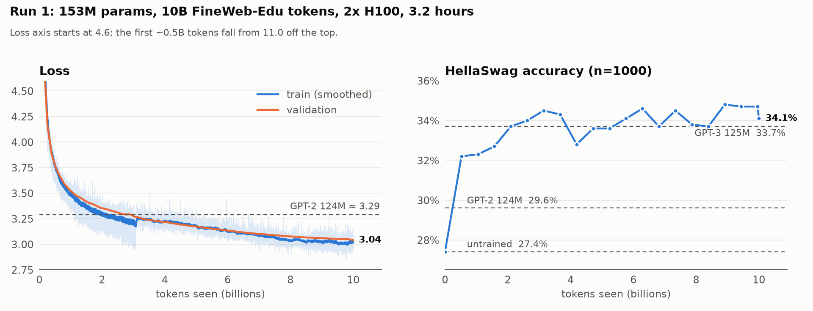

# gpt2-rebuild

A small language model built first by following nanogpt and thus building a GPT-2 style model
before converting in to the Llama 3 architecture. It was pretrained on 10B tokens and then 
fine tuned into a chat model.

Pretraining took around 3.2 hours on 2x H100 and cost about £23.

## Results

**Pretraining** (153M parameters, 10B tokens of FineWeb-Edu, one epoch)

| model | params | HellaSwag | val loss |
|---|---|---|---|
| **this model** | **153M** | **34.1%** (peak 34.8%) | **3.04** |
| GPT-2 124M | 124M | 29.6% | ~3.29 |
| GPT-3 125M | 125M | 33.7% | — |
| this model, untrained | 153M | 27.4% | 10.97 |

HellaSwag is scored on the first 1,000 validation examples (thus some noise).

<picture>
  <source media="(prefers-color-scheme: dark)" srcset="assets/run1_dark.png">
  
</picture>

Plotted from [`run1_log.txt`](run1_log.txt) by [`assets/plot_run1.py`](assets/plot_run1.py).
The step in train loss at ~3.07B tokens is a stretch of easier training text ending;
validation loss is smooth through it.

Two things to bear in mind. This model is ~23% larger than GPT-2 small (with the
untied `lm_head` contributing to most of this). It was also trained on FineWeb-Edu
which is known to lift HellaSwag compared with GPT-2's WebText. The result simply 
shows how surprising small models can be and taught me a lot about current architecture.

**Chat fine-tuning** (2 epochs on 451K conversations from
[smol-smoltalk](https://huggingface.co/datasets/HuggingFaceTB/smol-smoltalk), 28 min on 1x H100)

| | before | after |
|---|---|---|
| val loss (assistant tokens) | 2.44 | **1.35** |
| HellaSwag | 34.4% | 34.5% (no forgetting) |

```
> What is the capital of France?
The capital of France is Paris. Paris is known for its historical landmarks, cultural
institutions, and romantic ambiance. It is home to iconic sites such as the Eiffel
Tower, the Louvre Museum, and Notre-Dame Cathedral.

> Write a haiku about planes
Breathing air,
In planes, we have no space.
```

It handles the format of a conversation well and stops when it should. However
hallucination is a massive problem and it does seem to ramble a little.

## Architecture

| | GPT-2 (start) | this model (Llama 3-style) |
|---|---|---|
| normalisation | LayerNorm, post-attn | RMSNorm, pre-norm |
| positions | learned absolute | RoPE, θ = 500,000 |
| attention | multi-head (12 KV heads) | grouped-query (12 Q / 4 KV heads) |
| MLP | GELU, 4d | SwiGLU, hidden 2048 |
| biases | yes | none |
| embeddings | tied `wte` / `lm_head` | untied |
| shape | 12 layers, d=768, ctx 1024 | same |
| vocab | GPT-2 BPE (50257) | GPT-2 BPE, padded to 50304 |

[`llama3Changes.md`](llama3Changes.md) lists each change from GPT-2 to Llama 1, 2 and 3,
and what each version changed. The tokeniser stays GPT-2's so results remain comparable
with GPT-2 and the nanoGPT baseline.

## What's in here

I started this project by following Andrej Karpathy's
[build-nanogpt](https://github.com/karpathy/build-nanogpt) to get a working GPT-2.
Everything after that is my own extension:

- **Llama 3 conversion**: RMSNorm, RoPE (complex-valued), GQA, SwiGLU and untied
  embeddings, each added and checked against the expected parameter count.
- **The training run**: DDP across GPUs, `torch.compile`, bf16 autocast, gradient
  accumulation to a 524K-token batch, cosine LR schedule, atomic checkpointing with
  resume, and periodic validation, HellaSwag and sampling. ~880K tokens/s on 2x H100.
  Evaluation, sampling and checkpointing cost 0.6% of wall-clock time.
- **Sweeps before spending money**: learning rate (6e-4, the GPT-3 paper's value, was
  clearly worst; 1.2e-3 and 1.8e-3 tied; 3e-3 went unstable) and per-GPU batch size
  (throughput saturates at B=32–64; B=128 runs out of memory on an 80GB card).
- **Verification**: [`preflight.py`](preflight.py) runs 16 checks on a fresh GPU box
  before anything expensive starts, including an exact parameter-count assertion.
  1-GPU and 2-GPU runs produced bit-identical loss curves, which checks the per-rank
  data sharding, the gradient all-reduce and the accumulation maths together.
- **KV cache**: stores keys after RoPE, at GQA width (3x smaller than full multi-head).
  It's verified against the uncached forward pass on logits, not just sampled tokens.
  3.5x faster at 128 generated tokens and 5.1x at 256.
- **Supervised fine-tuning** ([`sft.py`](sft.py), [`sft_data.py`](sft_data.py)):
  - The chat template uses four of the 47 unused padding slots in the vocabulary, so
    the vocabulary didn't need resizing. Those rows had been weight-decayed towards
    zero during pretraining, so they're re-initialised from the trained rows'
    statistics. Every ordinary logit is bit-identical after the initialisation.
  - The loss only counts the assistant's replies and their end-of-turn token.
  - Long conversations are truncated at exchange boundaries, so no reply is cut off
    mid-turn.
  - Conversations are grouped by length within shuffled chunks, raising real tokens
    per batch from 59% to 99% with no attention leaking between conversations.
  - A 5-arm LR sweep picked 3e-4.

## Files

| file | purpose |
|---|---|
| [`train.py`](train.py) | model, data loader, config and pretraining loop |
| [`fineweb.py`](fineweb.py) | tokenises FineWeb-Edu (sample-10BT) into 100M-token shards |
| [`hellaswag.py`](hellaswag.py) | HellaSwag download, rendering and scoring |
| [`preflight.py`](preflight.py) | 16 checks to run on a rented GPU before training |
| [`sft_data.py`](sft_data.py) | renders smol-smoltalk into the chat template with loss masks |
| [`sft.py`](sft.py) | supervised fine-tuning loop |
| [`chat.py`](chat.py) | interactive REPL for either a base or a chat checkpoint |
| [`shapes.py`](shapes.py) | parameter counts for reference configs |
| [`run1_log.txt`](run1_log.txt) | full log of the pretraining run |
| [`llama3Changes.md`](llama3Changes.md) | notes on the GPT-2 -> Llama 3 deltas |

## Running it

```bash
pipenv install   # or: pip install "torch>=2.5" numpy tiktoken datasets tqdm pandas pyarrow

# laptop-sized model (48M params, CPU/MPS) to see it train
python train.py --preset cpu

# the real run, on a GPU box
python fineweb.py                         # ~20GB of training shards
python hellaswag.py                       # eval set + self-test
python preflight.py                       # exits non-zero if anything is wrong
torchrun --standalone --nproc_per_node=2 train.py --preset llama-124m --max-lr 1.2e-3 --B 64

# chat fine-tuning, starting from the pretrained weights.pt
python sft_data.py
python sft.py --max-lr 3e-4 --run-name sft-full

# talk to it (base or chat mode is detected from the checkpoint)
python chat.py --ckpt weights.pt
python chat.py --ckpt SFT_log/sft-full/ckpt_epoch2.pt
```

Every config field can be overridden from the command line (e.g. `--max-lr 1.8e-3
--no-compile`). Training data, checkpoints and weights are gitignored and aren't in
the repo.

## Known gaps

- **No document masking.** Training sequences span document boundaries without a
  block-diagonal mask or per-document RoPE resets. I kept it this way so run 1 stays
  comparable with the nanoGPT baseline, and it's the planned single variable for run 2.
- **Generation has no sliding window**, so prompt + output must fit in 1,024 tokens.
- **`sft.py` is single-GPU with no resume.** A full run takes under 30 minutes on one H100.
- **No preference tuning** (DPO/RLHF). The chat model is SFT only.
